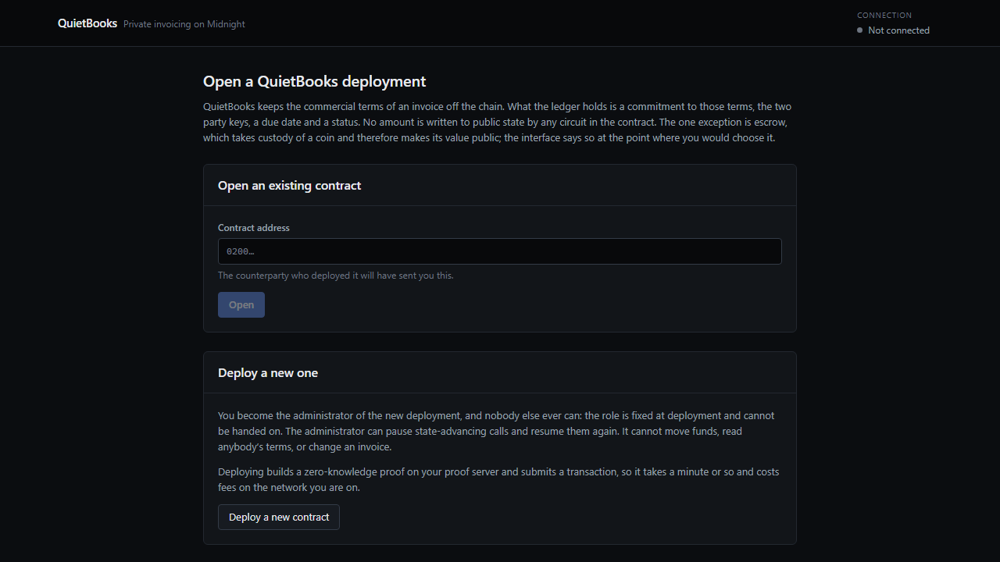
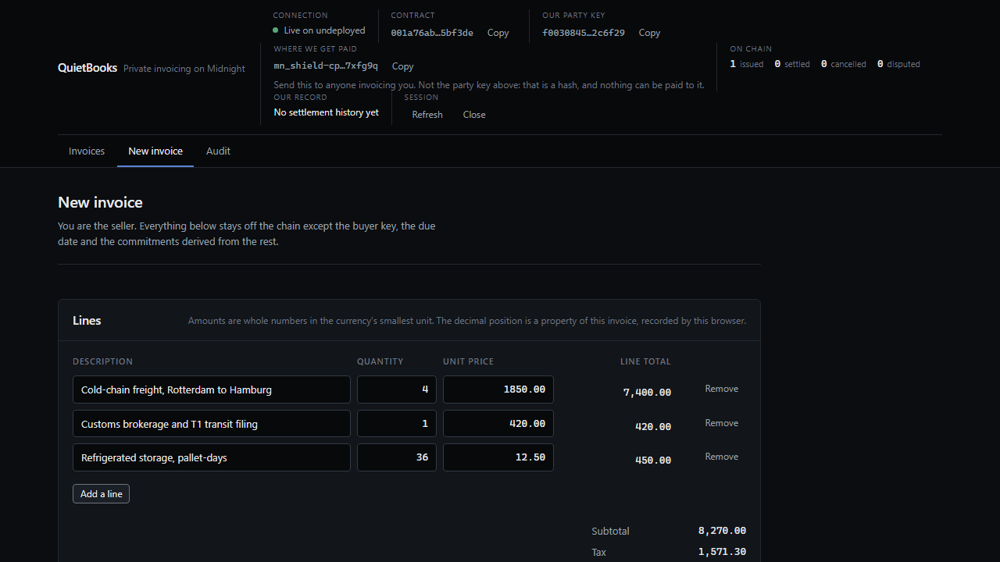
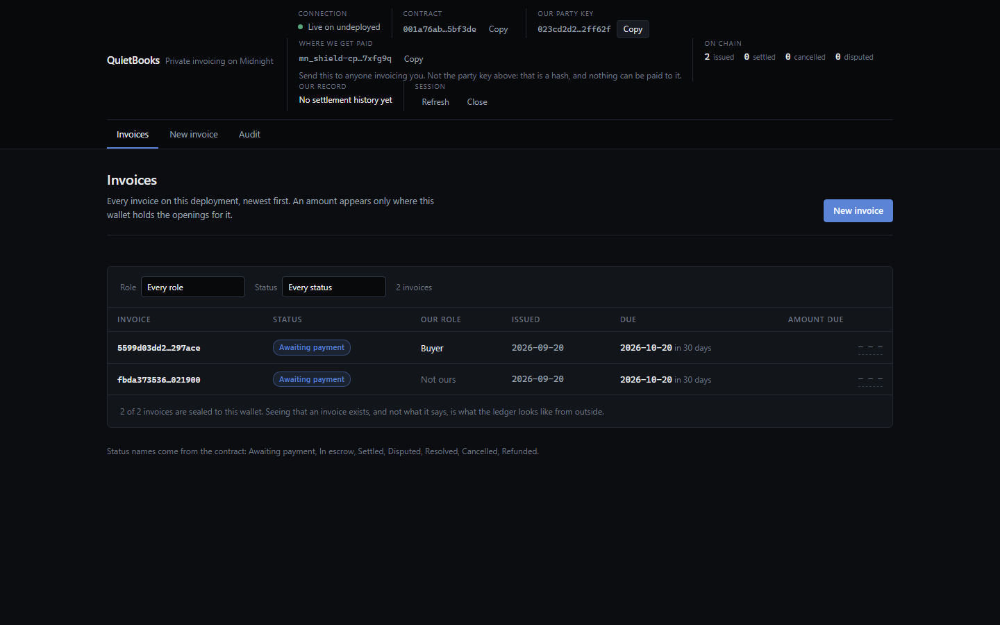
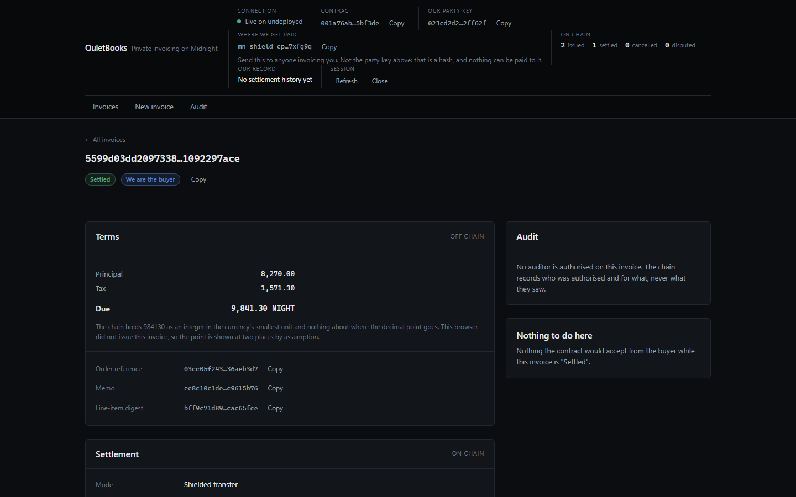
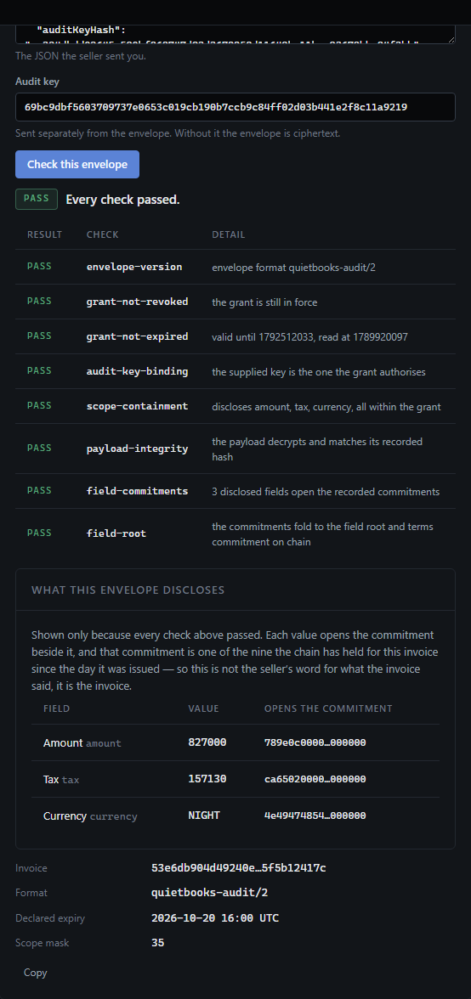
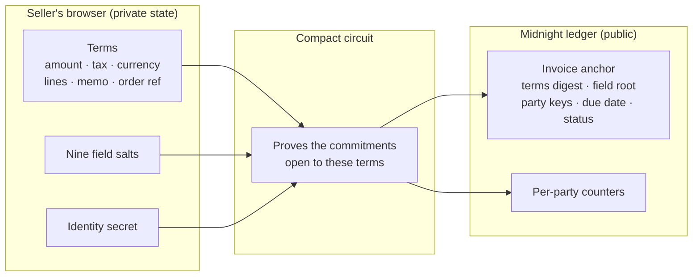
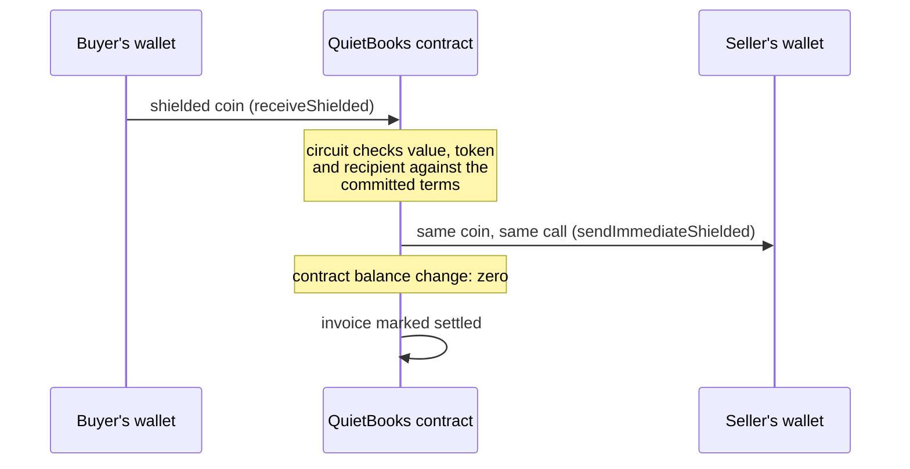

<div align="center">


# QuietBooks

**Invoices settle on-chain. Their terms never do.**

Private B2B invoicing, shielded settlement and selective audit on
[Midnight](https://midnight.network).

[](https://github.com/Ritik200238/quietbooks/actions/workflows/ci.yml)
[](LICENSE)
[](https://docs.midnight.network)
[](https://quietbooks.vercel.app)

[What the chain sees](#what-the-chain-can-and-cannot-see) ·
[See it running](#see-it-running) ·
[How it works](#how-it-works) ·
[What we verified](#what-we-verified) ·
[Quick start](#quick-start) ·
[Not built yet](#what-is-not-built-yet)

</div>

---

A supplier issues an invoice. The amount, the tax, the line items and the memo never
touch the chain. The buyer pays, and the payment and the record of it are one
transaction. Months later an auditor asks to see the amount and the tax on that one
invoice, and the supplier shows exactly those two fields, to exactly that auditor,
until exactly a date they choose — and the auditor can prove the numbers are the ones
the chain has held a commitment to since the day it was issued.

That last part is the point. Hiding data is easy: keep it off the chain. The hard part
is proving later that what you are showing someone is what you committed to at the
time, without having published it in the meantime.

---

## What the chain can and cannot see

Stated first, because the honest answer is more interesting than a marketing one.

| | |
|---|---|
| **Public, for every invoice** | that it exists, the two parties as rotatable pseudonyms, the issue date, the due date, the status, and four 32-byte digests. Aggregate counters for issued, settled, cancelled and disputed |
| **Private, never written to public state by any circuit** | the amount, the tax, the currency, the line items, the memo, the order reference, and every commitment opening |
| **The one exception** | escrow. A contract that holds a coin publishes what it holds, so `fundEscrow` makes that amount public. The interface says so at the point where you would choose it |

The privacy is enforced in circuits, not in the interface. No screen, no API call and no
CLI command can put an amount on the ledger, because no circuit writes one.

---

## See it running

Screens captured from the running interface, driven by a real wallet against a real
Midnight node — a local one, with a real proof server building every proof.

| | |
|:--:|:--:|
|  |  |
| **Open a deployment.** Deploy a new contract or join one by address. The identity that opens your invoices is a secret held by this browser, not by the wallet and not by the chain. | **Write an invoice.** Lines, tax, due date, memo and order reference. Everything here except the buyer key and the due date stays in this browser; the chain gets commitments. |
|  |  |
| **The list.** Every invoice on the deployment, with its public status. An amount appears only where this wallet holds the opening for it. | **Settled.** The buyer paid in shielded coin inside the transaction that marked the invoice settled. The chain records the settlement and not the sum. |

<div align="center">


**The audit console.** Eight checks, each reported separately, ending in the one that
matters: every disclosed value folds back into the field root the chain has held since
issuance.
</div>

---

## How it works



Every circuit takes the terms as a **witness**: a private input supplied by the caller's
own software, which means it is attacker-controlled by definition. The contract never
trusts it. It proves the terms open the commitment the chain already holds, and only
then acts on them.

### Settlement moves money without taking custody



We wanted the contract to hold the money and hide the amount. It cannot, and finding out
why drove the design:

- `receiveShielded` requires its argument to be disclosed, and a `ShieldedCoinInfo`
  carries a plaintext `value`.
- A contract that holds a coin publishes what it holds; `ContractState.balance` is public.
- OpenZeppelin's `ShieldedTreasury` says it in its own header: *"This treasury's HOLDINGS
  ARE PUBLIC."*

So custody and hidden amounts are mutually exclusive on Midnight today. But a contract can
**route** a payment without holding it: `receiveShielded` followed by
`sendImmediateShielded` in the same call passes the coin straight on. Nothing is ever in
custody, Zswap hides the value on both legs, and the payment and the settlement record
either both happen or neither does.

### The three settlement paths

| Path | Who calls it | Amount on chain | What binds it |
|---|---|---|---|
| `settleWithNote` | Buyer | Hidden | The coin is received and forwarded in one call. The circuit proves it is the invoiced total, in the invoiced token, to the seller payout address committed at issuance |
| `settleAttested` | Seller | Hidden | The seller vouches for a payment made off-chain. Only the seller may call it, because the seller is the party who loses by lying |
| `fundEscrow` → `releaseEscrow` | Buyer | **Public** | The contract holds the coin and releases it on confirmation, refunds it after a deadline, or moves it on an arbiter's ruling |

An escrow has three exits and none depends on one party staying reachable: the buyer
releases, the buyer refunds after the deadline, or the named arbiter rules. A dispute
nobody resolves falls through to the refund, so no combination of silence strands money.

### Identity is a secret, not a wallet key

`ownPublicKey()` is a documented anti-pattern for authorisation on Midnight, and it is
never used here. A party key is a domain-separated hash of a secret the user holds, salted
per deployment, so the same person is unlinkable across deployments and can rotate to a
fresh key with a PIN.

### Selective audit

An auditor is granted specific fields of one invoice, until a deadline. The nine
disclosable fields, in the fixed order the circuit, the envelope and the validator all
use: `amount`, `tax`, `dueDate`, `buyer`, `seller`, `currency`, `items`, `memo`,
`orderRef`.

On chain: the **hash** of an audit key, the field set, and an expiry. Nothing else. The
key and the data travel out of band in an AES-256-GCM envelope. The validator runs eight
checks and reports each one:

1. the envelope version is recognised
2. the grant is not revoked
3. the grant has not expired
4. the key hash matches the grant, and the supplied key hashes to it
5. the envelope discloses no field outside the grant
6. the ciphertext decrypts and its payload hash matches
7. every disclosed field's commitment recomputes from its plaintext and salt
8. all nine commitments fold back into the on-chain field root

A validator reports; it never throws. A passing report carries the fields it verified, and
a failing one carries nothing, so a tool showing an auditor a number is showing one the
checks were about.

---

## What we verified

Every number here comes from a command in this repository that you can run.

| Evidence | Result | Command |
|---|---|---|
| Contract test suite | **257 passing** | `npm test --workspace @quietbooks/contract` |
| API test suite | **28 passing** | `npm test --workspace @quietbooks/api` |
| Mutation testing: each security fix reverted, recompiled, tests required to fail | **18 of 18 killed** | `npm run test:mutation --workspace @quietbooks/contract` |
| Static check: no circuit reads a witness twice | **clean** | `npm run check:witness-reads --workspace @quietbooks/contract` |
| End to end on a real node, real proofs | **27 of 27 steps** | `npm run e2e --workspace @quietbooks/e2e` |
| Two wallets that share no keys | **15 of 15 steps** | `npm run e2e:two-party --workspace @quietbooks/e2e` |
| Deploy transaction against the block's write budget | **30,797 of 50,000 bytes (61.6%)** | printed by every run before submission |

The contract suite runs in process against the **compiled** contract: no Docker, no node,
no proof server. The end-to-end runs assert against state read back through the indexer
rather than against the local result of a call.

<details>
<summary><b>The two-wallet run, and why one wallet is not enough</b></summary>

The main end-to-end run makes the seller, buyer and arbiter three PINs of one wallet. That
is an honest test of the authorisation rules and a poor test of payment: paying the wrong
party is invisible when every party is you, and so is a shielded output the recipient
cannot decrypt, because midnight-js already knows the connected wallet's encryption key.

Both were real bugs here. The seller payout was unbound, so a buyer could settle by paying
themselves and have the invoice recorded as settled in full. The shared record carried no
seller encryption key, so a payment to anyone but yourself could not be built at all.

So the second run funds a stranger wallet from the genesis one, then issues, exports,
imports and settles between two wallets that share no keys and keep separate private
state:

```
PASS  the two wallets share no keys
PASS  the seller funds the buyer, who is a stranger to it
PASS  the seller issues an invoice to the buyer
PASS  the seller exports the record and the buyer imports it
PASS  the buyer pays the seller, who is a different wallet     (100.5s)
PASS  the money arrived in the seller's wallet, not the buyer's
PASS  the chain records the settlement and still hides the amount

15/15 steps passed
```

The seller's shielded balance rises by exactly the invoiced total and the buyer's falls by
it; then the amount is checked absent from the anchor and the settlement record. It bites:
dropping the seller's encryption key from the settle call fails the run with `Unable to
resolve encryption public key for recipient`.

</details>

---

## What a green test suite could not see

Four bugs that survived a passing suite. Each one changed the design, and each has a test
that goes red if the fix is reverted.

**A prover that lies.** `settleWithNote` read the terms witness twice: once to prove the
commitment, once to check the amount. A witness is whatever the caller's own software
returns, so a buyer could prove the real terms and then pay 1 unit against a 6,050,000
invoice. All tests stayed green, because every one of them ran the honest prover. Mutation
testing found it. A suite of deliberately lying provers and a CI check that no circuit
reads a witness twice now guard it.

**An audit envelope that smuggled data past its own containment check.** Every check read
the parsed JSON; the auditor reads bytes; `JSON.parse` silently keeps the last of two
duplicate keys. A seller could write `"disclosed"` twice — ungranted fields first, the
granted field second — and the containment check counted one field and passed. The
smuggled fields carried real salts, so the auditor ended up with cryptographic proof of an
amount they were never granted. The fix is a different question: the payload must **be**
its canonical serialisation, not merely parse to it.

**A design that passed every test and could never work.** The first settlement called
`kernel.claimZswapCoinReceive` on a buyer-to-seller payment. Every circuit test passed. A
receive claim only accepts outputs addressed to the claiming contract, so a real node
refused every such transaction as malformed. In-process tests never build a transaction;
the end-to-end run is what caught it.

**A wallet nobody had connected.** The web interface decoded the wallet's coin public key
with a hex reader, and a browser wallet writes Bech32m. Every real wallet threw `Invalid
character 'm' at position 0` before any contract call. The one wallet exercised in CI is
locally built and hands out hex, so the single call site that ran was the single call site
that worked.

---

## Why twelve entry points

A Midnight deploy carries one verifier key per entry point, and the whole transaction has
to fit inside one block. The limits are per block and multi-dimensional; the binding one
here is **50,000 bytes of persistent writes**.

We measured it rather than guessed: a probe deploys contracts of increasing size against a
real node. Fourteen entry points were rejected. Twelve fit, at 61.6% of the write budget,
and that is what shipped. The contract went from eighteen to twelve, and the rest of the
functionality moved inside the twelve rather than disappearing.

---

## Quick start

### Prerequisites

- Node 22
- Docker, for the local network and the proof server
- The Compact toolchain, pinned:

```bash
curl --proto '=https' --tlsv1.2 -LsSf \
  https://github.com/midnightntwrk/compact/releases/download/compact-v0.5.1/compact-installer.sh | sh
export PATH="$HOME/.local/bin:$PATH"
compact update 0.31.1
compact compile --version   # expect 0.31.1
```

`compact update` with no version installs a toolchain whose language version has moved
past the 0.23 this contract declares. It will not compile, and the error does not mention
versions. Midnight development is not supported on native Windows; use WSL2.

### Build and test

```bash
npm install
npm run compact     # compiles the contract, produces proving and verifying keys
npm run build
npm test            # 285 tests, no Docker required
```

### The local network

```bash
cd localnet
docker compose -f standalone.yml up -d
```

| Service | URL |
|---|---|
| Node | http://localhost:9944 |
| Indexer | http://localhost:8088/api/v4/graphql |
| Proof server | http://localhost:6300 |

### Run the whole product against it

```bash
npm run e2e --workspace @quietbooks/e2e             # 27 steps, one wallet
npm run e2e:two-party --workspace @quietbooks/e2e   # 15 steps, two wallets
```

### The interfaces

```bash
npm run dev --workspace @quietbooks/ui   # web, needs a Midnight Lace wallet
npm run cli                              # same API, no browser
```

The web interface is live at **[quietbooks.vercel.app](https://quietbooks.vercel.app)**,
built for Midnight's Preview network on every push: the deployment installs the pinned
Compact toolchain and compiles the proving keys, because a page that cannot prove is not a
product. Lace on Preview also needs a local proof server, which is Midnight's requirement
rather than ours.

`ui/.env.example` documents every variable. Unset, the interface uses the connected
wallet's own endpoints.

---

## Repository layout

```
contract/     The Compact contract, its witnesses, the domain model,
              the audit envelope, and 257 tests
api/          QuietBooksAPI: deploy, join, and drive a deployment
ui/           Vite + React interface, Lace connector
cli/          Interactive Node CLI
e2e/          End-to-end runs against a real network
localnet/     A self-contained Midnight network (Docker Compose)
docs/         Pitch deck, brand mark, interface captures
```

`contract/src/quietbooks.compact` is the place to start reading. Its header explains the
privacy model and why settlement works the way it does.

---

## The pinned stack

| | |
|---|---|
| Compact language / toolchain | `0.23` / `0.31.1` (devtools `0.5.1`) |
| midnight-js | `4.1.1` |
| compact-runtime / ledger | `0.16.0` / `8.1.0` |
| DApp connector API / wallet SDK | `4.0.1` / `1.2.0` |
| Proof server / indexer | `8.1.0` / `4.3.3` |
| Interface | React 18, Vite 6, TypeScript, Vitest |

Versions are pinned, not floated. The toolchain is installed by exact version in CI and in
the deployment build for the reason above.

---

## What is not built yet

Stated plainly, because a reader can check.

- **No mainnet, no external audit.** The end-to-end runs are on a local Midnight network.
- **No public Preview deployment yet.** The interface is built for Preview; the contract
  is not deployed there, so there are no public explorer links in this wave.
- **The reliability proof circuit.** The contract keeps the counters; proving "at least 20
  settled, 18 on time, none lost" without revealing the counts is the next circuit.
- **Multi-token issuance in the interface.** The contract binds every invoice to its
  token; the interface issues in the native one.
- **Partial payments, administrator rotation, vesting and payroll schedules.**

---

## Licence and attribution

Apache-2.0. See [LICENSE](LICENSE).

QuietBooks is built on patterns from the Midnight Foundation's own examples and from
OpenZeppelin's Compact contracts. [NOTICE](NOTICE) records every debt in detail: the
project layout and connector wiring from `example-bboard`, the witness-secret identity
model from `example-zkloan`, the local network composition from `midnight-local-dev`, and
the forwarder pattern that settlement is built on from
`@openzeppelin/compact-contracts`. Every circuit and every line of the application is
original to this project.

<div align="center">

**Invoices settle on-chain. Their terms never do.**

</div>
