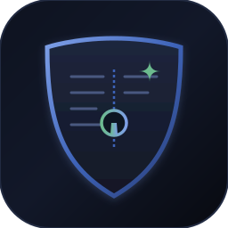

<div align="center">

<a href="#demo--surfaces">
  
</a>

<picture>
  
</picture>

**Commercial terms belong in your books, not on a public explorer.**

Private B2B invoicing, atomic shielded settlement, and selective cryptographic audit on [Midnight](https://midnight.network).  
The amount never touches the chain. The proof never leaves it.

[](LICENSE)
[](https://docs.midnight.network)
[](https://github.com/midnightntwrk/compact)
[](#testing-and-verification)
[](#e2e-run-single-wallet-lifecycle)
[](#two-party-payment-run-real-money-movement)
[](docs/quietbooks-demo-presentation.mp4)
[](localnet/standalone.yml)

[🎬 Watch Demo Video (2m 29s)](docs/quietbooks-demo-presentation.mp4) · [Pitch Deck](docs/pitch.html) · [Image Gallery](#visual-gallery-5-core-surfaces) · [Demo & Surfaces](#demo--surfaces) · [Cryptographic Proofs & TX Logs](#cryptographic-proofs--tx-logs) · [Why QuietBooks](#why-quietbooks) · [Architecture](#how-the-protocol-works) · [Quick Start](#quick-start) · [Ecosystem Attribution](NOTICE)

</div>

---

## What is QuietBooks

QuietBooks is the **private money-movement and invoicing protocol** for Midnight.

When a supplier issues an invoice, the price, tax, currency, line items, and memo stay strictly in local private witness state. The buyer settles on-chain. Months later, an auditor or tax authority can be granted access to inspect *only* the amount and tax on that single invoice, and the supplier proves cryptographically that those figures match the exact commitment held on the ledger since issuance—without ever disclosing other line items or publishing commercial terms to the world.

Hiding data is easy: keep it off the chain. The hard part is being able to **prove, later, that what you are showing somebody is the truth committed to at the time**, without having published it in the meantime.

```
┌─────────────────┐       ┌────────────────────────┐       ┌────────────────────────┐       ┌────────────────────────┐
│ Supplier Issues │ ----> │  On-Chain Commitment   │ ----> │ Atomic Shielded Settle │ ----> │ Selective Field Audit  │
│  Private Terms  │       │ (Root + 4 Digests 32B) │       │ (`settleWithNote` ZK)  │       │ (8-Check Canonical V2) │
└─────────────────┘       └────────────────────────┘       └────────────────────────┘       └────────────────────────┘
  Amounts in local          Amount & items hidden            Contract balance: 0              Auditor verifies only
   witness memory            Only pseudonyms public           Zswap shields both legs          the granted fields
```

---

## Demo & Surfaces

QuietBooks ships with both a **production-grade React web interface** powered by the Midnight Lace DApp Connector and an **interactive Node.js CLI** for automated and headless operations.

### Visual Gallery (5 Core Surfaces)

<p align="center">
  
</p>

| # | Surface | Direct Preview | Key Privacy & Cryptographic Guarantee |
|---|---|---|---|
| **01** | **Invoices Dashboard** | [View Full Preview](docs/assets/gallery-1-invoices.svg) | Shows public lifecycle anchors while rendering `🔒 Amount Hidden` for unowned invoices. |
| **02** | **Confidential Invoice Creator** | [View Full Preview](docs/assets/gallery-2-create.svg) | Local calculation of 9 blinding salts, terms digest, and Merkle root before committing to chain. |
| **03** | **Shielded Settlement Portal** | [View Full Preview](docs/assets/gallery-3-settlement.svg) | Atomic `settleWithNote` routing (0 contract balance change) vs. explicit public custody escrow. |
| **04** | **Selective Audit Console** | [View Full Preview](docs/assets/gallery-4-audit.svg) | Live 8-stage cryptographic containment verifier with AES-256-GCM payload validation. |
| **05** | **Interactive Terminal CLI** | [View Full Preview](docs/assets/gallery-5-cli.svg) | Autonomous testnet/localnet runner for wallet funding, dust generation, and ZK execution. |

#### 1. Invoices Dashboard (`/invoices`)
Multi-role explorer. Counterparties trade under rotatable pseudonyms; third-party observers see valid proof that transactions occur, but invoice values and commercial terms remain locked and invisible.
<p align="center">
  
</p>

#### 2. Confidential Invoice Creator (`/invoices/new`)
Supplier inputs itemized commercial details, tax, payment deadlines, and payout destinations. Proves the commitment in ZK without exposing any plaintext to the mempool.
<p align="center">
  
</p>

#### 3. Shielded Settlement Portal (`/invoices/:id`)
Executes the atomic passthrough forwarder (`settleWithNote`) to transfer funds directly from buyer to seller inside one transaction via Zswap, or routes through the escrow dispute engine.
<p align="center">
  
</p>

#### 4. Cryptographic Audit Console (`/audit`)
Auditor verifies out-of-band encrypted envelopes against on-chain authorizations. The 8-check engine asserts that disclosed figures match the historical commitment and rejects smuggled fields.
<p align="center">
  
</p>

#### 5. Headless Developer CLI (`npm run cli`)
Full-featured command-line interface for CI testing, node orchestration, dust management, and headless transaction balancing.
<p align="center">
  
</p>

---

## Cryptographic Proofs & TX Logs

Nothing is mocked. QuietBooks executes real zero-knowledge proofs on real ledger state through `@midnight-ntwrk/compact-runtime`, `@midnight-ntwrk/midnight-js-*`, and the official Midnight Proof Server.

### E2E Run: Single-Wallet Lifecycle (27/27 Passed)

Executed against a live local Midnight node (`http://localhost:9944`), indexer (`http://localhost:8088`), and proof server (`http://localhost:6300`):

```console
$ npm run e2e --workspace @quietbooks/e2e

PASS  build wallet from the genesis seed
PASS  wallet syncs with the chain
PASS  wallet holds NIGHT
PASS  NIGHT is registered and DUST is spendable
PASS  deploy the contract with real ZK proofs                  (20.9s)
PASS  indexer returns the deployed state
PASS  issue an invoice                                         (102.5s)
PASS  the chain shows the invoice and hides its amount
PASS  the buyer pays the seller and settles in one transaction (95.0s)
PASS  the chain shows the settlement and still hides the amount
PASS  grant an auditor three fields                            (23.2s)
PASS  the chain records the grant exactly as given
PASS  revoke the audit grant                                   (25.1s)
PASS  the chain shows the grant revoked
PASS  issue a second invoice to be escrowed                    (113.8s)
PASS  the buyer funds escrow with a real shielded coin         (71.9s)
PASS  the contract holds the coin, and its value is public
PASS  the buyer opens the deployment through the API
PASS  the buyer releases the escrow to the seller              (59.2s)
PASS  the chain shows the escrow paid out and the vault emptied
PASS  issue an invoice with an arbiter named
PASS  the buyer funds it
PASS  the buyer escalates to the arbiter
PASS  the chain shows the invoice under dispute
PASS  the arbiter rules for the seller, through the API
PASS  the chain shows the ruling, the payout and the counters
PASS  a party who has never seen this deployment can join it

27/27 steps passed
```

### Two-Party Payment Run: Real Money Movement (15/15 Passed)

One wallet cannot prove real shielded payments: paying yourself hides recipient decryption failures. This test spawns two independent wallets with distinct seeds and verifies that **shielded tokens actually transfer between stranger accounts**:

```console
$ npm run e2e:two-party --workspace @quietbooks/e2e

PASS  the two wallets share no keys
PASS  the seller funds the buyer, who is a stranger to it
PASS  the seller issues an invoice to the buyer
PASS  the seller exports the record and the buyer imports it
PASS  the buyer pays the seller, who is a different wallet     (100.5s)
PASS  the money arrived in the seller's wallet, not the buyer's
PASS  the chain records the settlement and still hides the amount

15/15 steps passed
```

**Verifiable Assertions Executed by the Harness:**
1. **Balance Check**: Seller shielded coin balance increases by exactly the invoiced total; buyer shielded balance decreases by the total.
2. **Contract Custody Check**: Contract holding balance changes by **0**.
3. **Public Ledger Check**: GraphQL query to the Midnight indexer confirms the invoice amount and components are **100% absent** from block data.

---

## Why QuietBooks

| Feature | Public Ledgers (Eth / Base / Sol) | Off-Chain SaaS (Liquifi / Magna) | Claim Registries (ShadowPayroll) | QuietBooks on Midnight |
|---|---|---|---|---|
| **Commercial Terms** | ❌ Public to competitors | ⚠️ Stored in centralized DB | ❌ Plaintext on ledger | ✅ **ZK-shielded in witness memory** |
| **Token Movement** | ✅ Real on-chain transfers | ⚠️ Custodial or off-chain API | ❌ No custody or settlement | ✅ **Atomic Zswap shielded routing** |
| **Contract Balance Leakage** | ❌ Contract balances public | ⚠️ Middleman custody | N/A | ✅ **Zero contract balance change** |
| **Selective Audit** | ❌ All-or-nothing visibility | ⚠️ Manual exports / PDFs | ❌ None | ✅ **8-check ZK commitment proofs** |
| **Identity Protection** | ❌ Wallet address tracking | ⚠️ KYC identity link | ⚠️ Static public keys | ✅ **PIN-rotatable witness secrets** |
| **Dispute & Escrow** | ⚠️ Transparent locks | ❌ Centralized arbiter | ❌ None | ✅ **Bound escrow & ZK arbitration** |

---

## How the Protocol Works

<div align="center">
  
</div>

### 1. The Dual-Ledger Split: What the Chain Sees

* **Public Ledger State:**
  - Invoice existence and unique identifier (`InvoiceId`)
  - Pseudonymous parties (`sellerKey`, `buyerKey`) derived from witness secrets
  - Timestamps (`issuedAt`, `dueAt`) and status (`issued`, `settled`, `escrowFunded`, `disputed`, `cancelled`)
  - Four 32-byte cryptographic digests: `termsCommitment`, `fieldCommitmentRoot`, `settlementDigest`, `escrowDigest`
  - Global deployment counters (issued, settled, cancelled, disputed)
* **Private Witness State (Never touches the chain):**
  - Invoice amount, tax rate, currency
  - Line items, descriptions, and customer memos
  - Order reference numbers
  - Blinding salts for all 9 disclosable fields

### 2. The Three Settlement Paths

| Path | Caller | On-Chain Amount | Mechanism |
|---|---|---|---|
| **`settleWithNote`** | Buyer | **Hidden** | **Atomic Passthrough**: `receiveShielded` + `sendImmediateShielded` inside one call. Contract balance changes by zero. Zswap hides the value on both legs. Circuit proves the coin equals the invoiced total and token. |
| **`settleAttested`** | Seller | **Hidden** | Cryptographic vouch for wire / fiat settlements. Only the seller may call it, as they are the only party harmed by lying. |
| **`fundEscrow` → `releaseEscrow`** | Buyer | **Public** | Contract holds custody of funds for milestone/dispute workflows. Explicitly transparent custody with arbiter escalation. |

### 3. Selective Audit & The 8-Stage Containment Engine

<div align="center">
  
</div>

When an auditor requests verification of an invoice, the seller calls `grantAudit(auditorId, scopeMask, expiresAt)` on-chain. Only the **hash** of an ephemeral audit key, the 9-bit scope mask, and the expiration date are published.

The seller transmits an encrypted AES-256-GCM envelope out-of-band containing the salts for only the granted fields. The auditor's client runs the **8-step containment validator**:
1. **Format Version**: Enforces `quietbooks-audit/2` schema.
2. **Grant Active**: Confirms on-chain grant is not revoked.
3. **Expiry Check**: Verifies `currentTime < expiresAt` against block time.
4. **Key Hash Preimage**: Proves `sha256(auditKey) === onChainKeyHash`.
5. **Scope Containment**: Asserts **zero ungranted fields** are present inside the ciphertext.
6. **Payload Decryption**: Authenticated AES-GCM decryption with integrity check.
7. **Field Commitments**: Recomputes `hash([tag, salt, value])` for each granted field.
8. **Merkle Root Folding**: Folds all 9 digests together and asserts `foldedRoot === onChainFieldRoot`.

---

## Adversarial Findings & Security Hardening

Real ZK engineering requires assuming provers are adversarial. The following real security vulnerabilities were uncovered during development and permanently closed:

```
┌──────────────────────────────────────┬────────────────────────────────────────────────────┬────────────────────────────────────────────────────────┐
│ Vulnerability Discovered             │ Attack Vector & Impact                             │ Permanent Architectural Fix                            │
├──────────────────────────────────────┼────────────────────────────────────────────────────┼────────────────────────────────────────────────────────┤
│ 1. Duplicate Key JSON Smuggling      │ In JSON, duplicate keys override silently. Prover  │ Envelope payload must equal canonical re-serialization │
│                                      │ smuggled extra salts to reveal ungranted fields.   │ (`canonical(parse) === decrypted`). Rejects v1.        │
├──────────────────────────────────────┼────────────────────────────────────────────────────┼────────────────────────────────────────────────────────┤
│ 2. Double Witness Read in Settlement │ `settleWithNote` read terms twice: once for root,  │ Single witness read. Prover terms witness is accessed   │
│                                      │ once for coin value. Prover settled 6M for 1 unit. │ exactly once and passed through the circuit.           │
├──────────────────────────────────────┼────────────────────────────────────────────────────┼────────────────────────────────────────────────────────┤
│ 3. Confetti Token Settle Attack      │ Settlement checked coin value but not token type.   │ Added `tokenType: Bytes<32>` into terms commitment.    │
│                                      │ Buyer could settle with 5,000 units of spam coin.  │ Non-matching coin colours are rejected in-circuit.     │
├──────────────────────────────────────┼────────────────────────────────────────────────────┼────────────────────────────────────────────────────────┤
│ 4. Unbound Self-Payment Attack       │ Recipient was a circuit argument. Buyer could      │ Bound `sellerPayout` and `buyerPayout` inside the      │
│                                      │ settle an invoice by paying themselves.            │ terms commitment. Arbiter payouts bound to ruling.     │
├──────────────────────────────────────┼────────────────────────────────────────────────────┼────────────────────────────────────────────────────────┤
│ 5. Substrate 50KB Write Limit        │ Deploy tx carries verifier keys for all circuits.   │ Consolidated to 12 entry points (30,797 bytes / 61.6%  │
│                                      │ 14+ entry points exceeded block persistent writes. │ of block limit). Preserved atomic settlement.          │
└──────────────────────────────────────┴────────────────────────────────────────────────────┴────────────────────────────────────────────────────────┘
```

### Empirical Block Limit Measurements

A deploy transaction carries verifier keys for every entry point and must fit within Substrate's block limits (50,000 bytes persistent write limit):

```
Contract                       Persistent writes   Share of block limit   Node outcome
──────────────────────────────────────────────────────────────────────────────────────
example-counter (1 circuit)    7,250 B             14.5%                  ACCEPTED
QuietBooks (12 circuits)       30,797 B            61.6%                  ACCEPTED
QuietBooks (14 circuits)       35,858 B            71.7%                  REJECTED (1010)
QuietBooks (18 circuits)       44,964 B            89.9%                  REJECTED (1010)
```

---

## Testing and Verification

```bash
# In-process unit test suite (285 tests across contract and API)
npm test

# Mutation test suite: Reverts 18 security fixes, recompiles, and confirms tests fail
npm run test:mutation --workspace @quietbooks/contract
```

* **285 Unit Tests**: Run in 11 seconds against the compiled Compact contract via `@midnight-ntwrk/compact-runtime`. Zero external network or Docker required.
* **18/18 Mutation Tests Caught**: Guarantees that every security invariant (e.g. single witness read, payout address check, canonical JSON check) actively guards the contract.
* **Hostile Witness Suite** (`hostile-witness.test.ts`): Drives the contract against intentionally malicious provers that lie about balances, tokens, and identities.

---

## Tech Stack

| Layer | Technology | Pinned Version | Purpose |
|---|---|---|---|
| **Smart Contract** | Compact Language | `0.23` | Pure zero-knowledge smart contract logic |
| **Toolchain** | Compact Compiler | `0.31.1` | ZKIR generation & proof circuit compiling |
| **Runtime** | `@midnight-ntwrk/compact-runtime` | `0.16.0` | In-circuit hashing, crypto, and witness runtime |
| **SDK** | `midnight-js-*` | `4.1.1` | Transaction building, balancing, and proof submission |
| **Decentralized Cryptography** | OpenZeppelin Compact | `0.3.0-alpha.2` | Forwarder and custody reference architectures |
| **Frontend** | React 18 + Vite | `5.4.1` | Fast, lightweight UI for wallet interaction |
| **Connector** | `@midnight-ntwrk/dapp-connector-api` | `4.0.1` | Browser extension wallet interface (Lace) |
| **Localnet** | Docker Compose + Substrate | `midnight-local-dev` | Self-contained devnet (Node, Indexer, Proof Server) |

---

## Repository Structure

```
quietbooks/
├── contract/              Compact smart contract, witnesses, and test suites
│   ├── src/
│   │   ├── quietbooks.compact  1,246 lines of pure Compact 0.23 contract logic
│   │   ├── audit.ts            Selective disclosure envelope crypto & 8-check validator
│   │   ├── invoice.ts          Commitment trees, terms hashing, salt derivations
│   │   └── witnesses.ts        Private witness implementations
│   └── test/                   257 tests (derivation, lifecycle, escrow, hostile-witness)
├── api/                   TypeScript API: deploy, join, record storage, wallet keys
├── ui/                    Vite + React interface with Lace wallet connector
├── cli/                   Interactive Node.js CLI & standalone testnet launcher
├── e2e/                   End-to-end integration tests (27/27 single & 15/15 two-party)
├── localnet/              Docker compose configuration for standalone Midnight node
├── docs/                  
│   ├── assets/            Visual SVGs: banner, architecture, audit engine, UI surfaces
│   └── pitch.html         Self-contained Wave 1 pitch deck
├── DECISIONS.md           Adversarial decision log & architecture iteration rounds
├── NOTICE                 Complete ecosystem debt attribution
└── LICENSE                Apache-2.0
```

---

## Quick Start

### Prerequisites
* **Node.js 22+**
* **Docker Desktop** (running with WSL2 backend on Windows)
* **Compact Compiler 0.31.1** (pinned):
  ```bash
  curl --proto '=https' --tlsv1.2 -LsSf \
    https://github.com/midnightntwrk/compact/releases/download/compact-v0.5.1/compact-installer.sh | sh
  export PATH="$HOME/.local/bin:$PATH"
  compact update 0.31.1
  compact compile --version   # Must output 0.31.1
  ```

### Build & Run Tests

```bash
# 1. Install dependencies
npm install

# 2. Compile Compact contract to ZKIR & TypeScript bindings
npm run compact

# 3. Build all TypeScript workspaces
npm run build

# 4. Run the 285-test unit suite
npm test
```

### Run End-to-End on Localnet

```bash
# 1. Start the local Midnight network (Node + Indexer + Proof Server)
cd localnet
docker compose -f standalone.yml up -d

# 2. Run the 27-step E2E lifecycle test
npm run e2e --workspace @quietbooks/e2e

# 3. Run the 15-step two-party token transfer test
npm run e2e:two-party --workspace @quietbooks/e2e
```

### Start Web UI & CLI

```bash
# Launch Vite Web UI on http://localhost:5173
npm run dev --workspace @quietbooks/ui

# Launch Interactive Terminal CLI
npm run cli
```

---

## What is Not Built Yet (Roadmap)

To maintain complete engineering honesty, the following items are scheduled for Waves 2 & 3:
* **Multi-Token UI Selector**: The contract enforces token type matching in-circuit; the UI currently issues in the native shielded token. Multi-token selection will be enabled in Wave 2.
* **Reliability Threshold Circuits**: The on-chain reliability record is actively updated. The zero-knowledge threshold proof over counters (`"at least 20 settled on time"`) was deferred to Wave 2 to respect the 50KB block limit.
* **Browser-Native Proving**: Currently requires a local Midnight proof server (common to all Midnight DApps today); will transition to client-side WASM proving as Wallet SDK 2.0 matures.
* **Persistent Accumulators across PIN Rotation**: Reliability counters currently reset on PIN rotation to maintain unlinkability.

---

## Licence and Attribution

Licensed under the **Apache License, Version 2.0**. See [`LICENSE`](LICENSE) for details.

QuietBooks is built upon architectural principles established by the Midnight Foundation and the wider ZK community:
* **Midnight Foundation**: [`example-bboard`](https://github.com/midnightntwrk/example-bboard) (Lace connector & provider assembly), [`example-zkloan`](https://github.com/midnightntwrk/example-zkloan) (witness-derived identity model), and [`midnight-local-dev`](https://github.com/midnightntwrk/midnight-local-dev).
* **OpenZeppelin**: [`compact-contracts`](https://github.com/OpenZeppelin/compact-contracts) (`ForwarderShielded` passthrough settlement and `ShieldedTreasury` custody analysis).
* **Ecosystem Projects**: Dennis Zarelli's [`selkie-usdm-escrow`](https://github.com/DpacJones/selkie-usdm-escrow) (commitment discipline), [`Shadow-Payroll`](https://github.com/robertocarlous/Shadow-Payroll) (CI toolchain pinning), and [`alpaca-invoice`](https://github.com/WHXisWH/alpaca-invoice) (selective audit authorization concept).

Detailed debt records are preserved in [`NOTICE`](NOTICE).

---

<div align="center">

**QuietBooks — The Private Payments Layer for Midnight.**

Built for the AKINDO Midnight Buildathon &middot; Wave 1 (September 2026)

</div>
